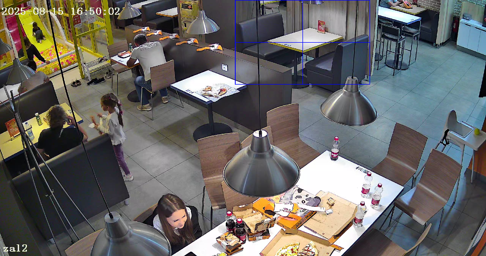
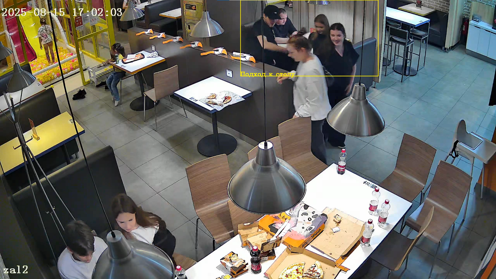

# Мониторинг занятости стола

Анализ видеозаписи для определения моментов, когда столик свободен, когда к нему подходят посетители и когда он занят.
Программа строит прямоугольник вокруг выбранного стола, отслеживает его состояние с помощью модели YOLO v8 nano
и выводит статистику по времени между циклами ухода гостя от столика и подходом нового человека.

## Запуск проекта

### 1. Клонировать репозиторий и перейти в папку проекта
```bash
git clone https://github.com/SufiyarovDanil/DoDoPizzaTest.git
cd DoDoPizzaTest
```

### 2. Создать виртуальное окружение

```bash
python -m venv .venv
source venv/bin/activate    # linux, macOs
.venv/Scripts/activate      # windows
```

### 3. Установить зависимости

```bash
python install -r requirements.txt
```

### 4. Запустить программу

```bash
python main.py --video "путь/к/видео.mp4"
```

После запуска откроется окно с первым кадром из видеозаписи.
Необходимо выделить область стола (зажать левую кнопку мыши и обвести прямоугольник) и нажать `Enter` или `Space`.
Для отмены выбора нажать `C`.

Результат обработки сохраняется в файл `output.mp4`.

Для анализа использовалось `видео 1.mp4` и следующий столик:


### Логика работы программы

Для анализа используется предобученная модель YOLOv8n.
На каждом кадре ищутся люди, после чего для каждого обнаруженного вычисляется отношение с областью стола:

1. Стол занят (taken) - Человек полностью помещается в выделенную область со столом.
2. Подход к столу (approach) - Человек частично пересекается с областью стола.
3. Стол пустой (empty) - Нет пересечений между выделенной областью и людьми в кадре.

### Аналитика

Среднее время между уходом гостя и подходом следующего человека: 5.49 сек.
Общее количество циклов ухода и подхода к столу: 157
Интервалы (в секундах): [0.00, 29.00, 0.00, ..., 26.00, 2.00, 0.00, 0.00]

В наборе интервалов присутствуют весьма маленькие значения, вызванные некорректным определением
моделью наличия человека за столом в единичных кадрах.
Это недостаток можно компенсировать, отфильтровывая интервалы, длительностью меньше нескольких секунд.

### Пример проблемного кадра


